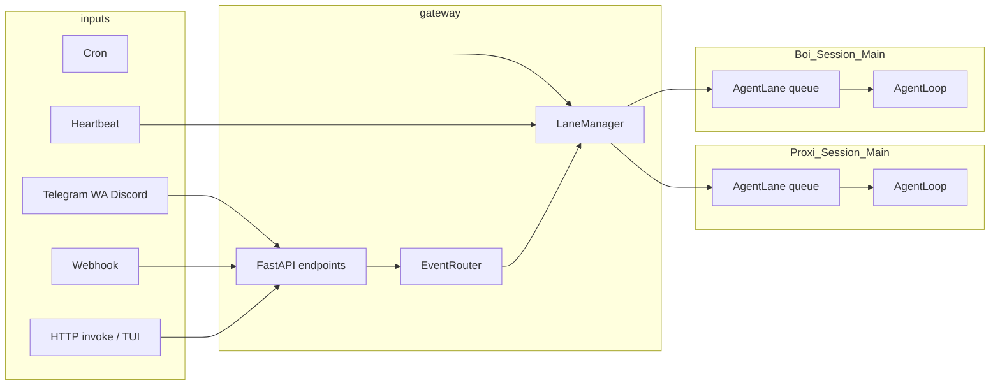

# Proxi

Developer names: Gourob, Ajay, Aman, Savinay  
Project start: Sep 15, 2025

## Table Of Contents

- [Overview](#overview)
- [Architecture](#architecture)
- [Workspace Layout](#workspace-layout)
- [Tech Stack](#tech-stack)
- [Installation](#installation)
- [Configuration](#configuration)
- [Usage](#usage)
- [TUI Slash Commands](#tui-slash-commands)
- [Development](#development)

## Overview

Watch the [user guide on YouTube](https://www.youtube.com/watch?v=vR8O_09WrnM).

Proxi is a dynamic AI assisstant focused on making computers more accessible for individuals who face barriers with traditional interfaces and for power users who want to get more work done.

Proxi can access virtually any integration such as your google workspace, weather, spotify, browser and do work on your behalf. Feel free to open an issue if you'd like for any other integrations to be added!

Proxi can be accessed via a terminal TUI, our own GUI(react_frontend) or a supported channel like whatsapp or discord. Currently the GUI is the only way to access the setup wizard and play with settings and setup cron jobs etc. 

## Architecture

Proxi is now interfaced via the **Gateway**:



- `proxi` launches the Ink TUI.
- The launcher ensures `proxi-gateway` is running.
- The TUI communicates with the gateway over HTTP/SSE.
- The gateway manages agent lanes, session state, MCP availability, and streaming responses.

Core agent loop:

```
User Goal
   ↓
Primary Agent (Planner / Orchestrator)
   ↓
┌──────────────┬──────────────┬──────────────┬─────────────────────────┐
│   Tools      │   MCPs       │  Sub-Agents  │ show_collaborative_form │
│ (stateless)  │ (external)   │ (stateful)   │  (human-in-the-loop)    │
└──────────────┴──────────────┴──────────────┴─────────────────────────┘
```

**REASON -> DECIDE -> ACT -> OBSERVE -> REFLECT -> LOOP**

Decision types:

| Decision Type | Description |
|---|---|
| `RESPOND` | Send a normal assistant response |
| `TOOL_CALL` | Execute a tool (including MCP-backed tools) |
| `SUB_AGENT_CALL` | Delegate work to a sub-agent |
| `REQUEST_USER_INPUT` | Request structured user input via a collaborative form |

> Note: `proxi-bridge` still exists for compatibility/debugging but is deprecated in favor of gateway transport.

## Workspace Layout

Default workspace root is `~/.proxi` (overridable with `PROXI_HOME`):

```text
~/.proxi/
├── global/
│   └── system_prompt.md
├── agents/
│   └── <agent_id>/
│       ├── Soul.md
│       ├── config.yaml
│       └── sessions/
│           └── <session_id>/
│               ├── history.jsonl
│               ├── plan.md
│               └── todos.md
└── gateway.yml
```

`gateway.yml` is the source of truth for configured agents and channel/source settings.

## Tech Stack

- Python 3.12+
- `uv` for Python environment and task execution
- FastAPI + Uvicorn for gateway server runtime
- Pydantic + asyncio + structlog
- Bun + Ink for the terminal TUI
- React for GUI frontent

## Installation

Prerequisites:

- Python 3.12+
- [`uv`](https://docs.astral.sh/uv/)
- [`bun`](https://bun.sh) (for TUI dependencies)

From the repository root:

```bash
uv sync
```

Install TUI dependencies once:

```bash
cd cli_ink
bun install
```

## Configuration

### API keys

API keys are stored in `config/api_keys.db`.

Initialize explicitly (optional; many flows do this automatically):

```bash
uv run python scripts/init_api_keys_db.py
```

Set keys via CLI:

```bash
uv run python -m proxi.security.key_store upsert --key OPENAI_API_KEY --value "your-key-here"
uv run python -m proxi.security.key_store upsert --key ANTHROPIC_API_KEY --value "your-key-here"
```

### Useful environment variables

| Variable | Description |
|---|---|
| `PROXI_HOME` | Override workspace root (default `~/.proxi`) |
| `PROXI_PROVIDER` | Default provider for `proxi-run` (`openai` or `anthropic`) |
| `PROXI_MAX_TURNS` | Max turns for one-shot tasks |
| `PROXI_MCP_SERVER` | Default MCP server command for one-shot runs |
| `PROXI_NO_SUB_AGENTS` | Set `1` to disable sub-agent delegation |
| `PROXI_GATEWAY_HOST` | Gateway bind host (if overridden) |
| `PROXI_GATEWAY_PORT` | Gateway bind port (if overridden) |
| `PROXI_GATEWAY_URL` | TUI target URL for an already-running gateway |
| `PROXI_WORKING_DIR` | Root directory for coding tools (default: current directory) |

### Coding tools

Proxi ships with a built-in coding toolset that enables it to act as a coding agent.  These tools are also useful for general tasks (searching files, running scripts, etc.).

| Tool | Description |
|---|---|
| `grep` | Regex search across files (ripgrep when available, Python fallback) |
| `glob` | Find files by pattern (e.g. `**/*.py`) |
| `read_file` | Read file contents, supports `offset`/`limit` for line ranges |
| `edit_file` | Exact-string replacement edit (requires unique match by default) |
| `write_file` | Write or overwrite a file |
| `diff` | Show git diff for a file or full working tree |
| `apply_patch` | Apply a unified diff patch via `git apply` |
| `execute_code` | Run a shell command in the working directory |

All file and shell tools are path-guarded to `PROXI_WORKING_DIR` when set, preventing reads/writes outside the project root.

**Per-agent configuration** — each agent's `~/.proxi/agents/<id>/config.yaml` controls which tier coding tools are registered at:

```yaml
tool_sets:
  coding: live      # live (always in context) | deferred (discovered on demand) | disabled
```

## Usage

### Interactive TUI (default)

```bash
proxi
# or
uv run proxi
```

This starts the TUI and connects it to the gateway (starting the gateway daemon if needed).

### One-shot CLI task

```bash
# Default provider
uv run proxi-run "Your task here"

# Explicit provider
uv run proxi-run --provider anthropic "Your task here"

# Extra options
uv run proxi-run --max-turns 30 --log-level DEBUG "Your task here"

# Filesystem MCP shortcut
uv run proxi-run --mcp-filesystem "." "List all files in the current directory"

# Custom MCP command
uv run proxi-run --mcp-server "npx:@modelcontextprotocol/server-filesystem /path" "Your task"
```

### Gateway management

```bash
uv run proxi-gateway-ctl start
uv run proxi-gateway-ctl status
uv run proxi-gateway-ctl stop
```

## TUI Slash Commands

Type `/` in the input box to open the command palette.

| Command | What it does |
|---|---|
| `/agent` | Switch the active agent or create a new one |
| `/delete` | Delete the current agent (removes agent from `gateway.yml` and deletes its workspace directory) |
| `/mcps` | Open MCP toggle flow to enable/disable integrations |
| `/clear` | Clear current chat UI and clear active session history |
| `/plan` | Open the current session plan view (`plan.md`) |
| `/todos` | Open the current session todos view (`todos.md`) |
| `/help` | Print the command reference in chat |
| `/exit` | Exit the TUI |

Related notes:

- `/switch-agent` is accepted as an alias for `/agent`.
- Up/down arrows in an empty input field cycle input history.
- Collaborative forms appear when the agent requests structured input.

## Development

Run TUI directly with Bun:

```bash
# From repository root
bun run proxi-tui

# Or inside cli_ink/
cd cli_ink
bun run dev
bun run start
```

Run tests:

```bash
pytest tests/ -v
```

Optional verification:

- **Bridge only:** From project root, run `uv run proxi-bridge`. You should see `{"type":"ready"}`. (Ctrl+C to exit.) This checks that the Python agent bridge starts correctly.
- **Full flow:** Run `proxi` or `uv run proxi`; you should see the boot sequence, agent selection (if applicable), and a prompt. Type a task and press Enter.
