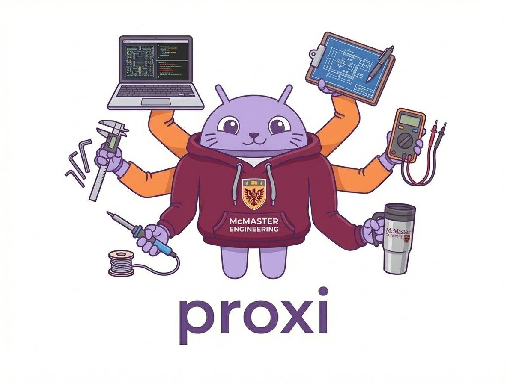
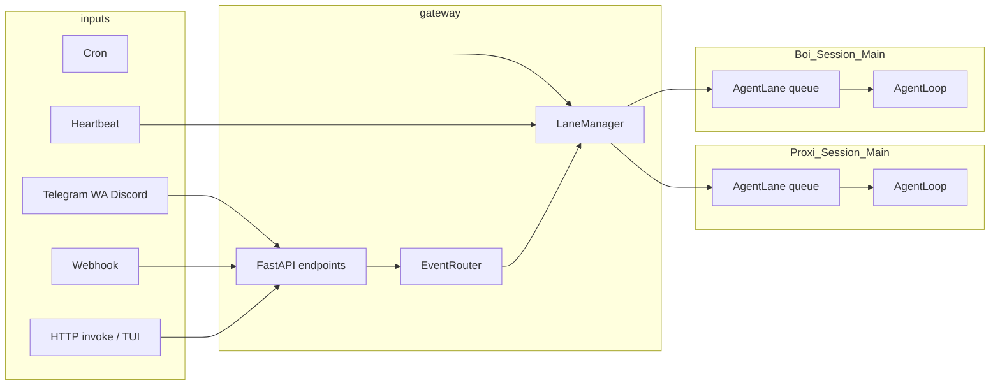

# Proxi

<p align="center">
  
</p>


## Overview

Watch the [user guide on YouTube](https://www.youtube.com/watch?v=vR8O_09WrnM).

Proxi is a dynamic AI assisstant focused on making computers more accessible for individuals who face barriers with traditional interfaces and for power users who want to get more work done.

Proxi can access virtually any integration such as your google workspace, weather, spotify, browser and do work on your behalf. Feel free to open an issue if you'd like for any other integrations to be added!

Proxi can be accessed via a terminal TUI, our own GUI(react_frontend) or a supported channel like discord or whatsapp(pending). Currently the GUI is the only way to access the setup wizard and play with settings and setup cron jobs etc. 

## Table Of Contents

- [Tech Stack](#tech-stack)
- [Installation](#installation)
- [Architecture](#architecture)
- [Workspace Layout](#workspace-layout)
- [Memory](#memory)
- [Configuration](#configuration)
- [Usage](#usage)
- [TUI Slash Commands](#tui-slash-commands)
- [Development](#development)


## Tech Stack

- Python 3.12+
- `uv` for Python environment and task execution
- FastAPI + Uvicorn for gateway server runtime
- Pydantic + asyncio + structlog
- Bun + Ink for the terminal TUI
- React for GUI frontent

## Installation

Prerequisites:

- Python 3.12+
- [`uv`](https://docs.astral.sh/uv/)
- [`bun`](https://bun.sh) (for TUI dependencies)

From the repository root:

```bash
uv sync
```

Install TUI dependencies once:

```bash
cd cli_ink
bun install
```

## Configuration

### API keys

API keys are stored in `config/api_keys.db`.

Initialize explicitly (optional; many flows do this automatically):

```bash
uv run python scripts/init_api_keys_db.py
```

Set keys via CLI:

```bash
uv run proxi keys upsert --key OPENAI_API_KEY --value "your-key-here"
uv run proxi keys upsert --key ANTHROPIC_API_KEY --value "your-key-here"
```

### Integrations (enable / disable)

Enable flags for integrations (Gmail, Calendar, Spotify, weather, etc.) are stored in the same SQLite DB as API keys (`config/api_keys.db`). From the repo root you can list and flip them with:

```bash
uv run proxi keys list-integrations
uv run proxi keys enable-integration gmail
uv run proxi keys disable-integration gmail
```

You can also turn integrations on or off from the **TUI** with `/integrations` or from the **React app** settings.

**When tool lists update:** The running gateway reloads which integration tools are registered (live, deferred, and `call_tool`) when you toggle from the TUI or React UI, and again when a session **sends a message** (so changes made only with `proxi keys` while the gateway is up usually apply on the next send without restarting). After that refresh, the model’s tool list in logs like `api_calls.json` should match—disabled integrations drop out. There are also execute-time checks so a disabled integration won’t run even if something were stale. **`uv run proxi gateway restart`** is still the simplest way to force everything in sync with the database.

## Architecture

Proxi is now interfaced via the **Gateway**:



- `proxi` launches the Ink TUI.
- The launcher ensures `proxi-gateway` is running.
- The TUI communicates with the gateway over HTTP/SSE.
- The gateway manages agent lanes, session state, MCP availability, and streaming responses.

Core agent loop:

```
User Goal
   ↓
Primary Agent (Planner / Orchestrator)
   ↓
┌──────────────┬──────────────┬──────────────┬─────────────────────────┐
│   Tools      │   MCPs       │  Sub-Agents  │ show_collaborative_form │
│ (stateless)  │ (external)   │ (stateful)   │  (human-in-the-loop)    │
└──────────────┴──────────────┴──────────────┴─────────────────────────┘
```

**REASON -> DECIDE -> ACT -> OBSERVE -> REFLECT -> LOOP**

Decision types:

| Decision Type | Description |
|---|---|
| `RESPOND` | Send a normal assistant response |
| `TOOL_CALL` | Execute a tool (including MCP-backed tools) |
| `SUB_AGENT_CALL` | Delegate work to a sub-agent |
| `REQUEST_USER_INPUT` | Request structured user input via a collaborative form |


## Workspace Layout

Default workspace root is `~/.proxi` (overridable with `PROXI_HOME`):

```text
~/.proxi/
├── global/
│   └── system_prompt.md
├── agents/
│   └── <agent_id>/
│       ├── Soul.md
│       ├── config.yaml
│       └── sessions/
│           └── <session_id>/
│               ├── history.jsonl
│               ├── plan.md
│               └── todos.md
└── gateway.yml
```

`gateway.yml` is the source of truth for configured agents and channel/source settings.

## Memory

Proxi maintains persistent memory across sessions so agents can recall past conversations, reuse proven workflows, and build up a model of the user over time.

There are three memory types:

| Type | What it stores | Storage |
|---|---|---|
| **Episodic** | Summaries of past sessions with topic tags | SQLite FTS5 (`memory.db`) |
| **Skills** | Reusable multi-step workflows (agentskills.io format) | Markdown files (`skills/<name>/SKILL.md`) |
| **User model** | User preferences, style, environment, coding conventions | `USER.md` (capped at ~600 tokens) |

At the end of each session a background task summarizes the conversation using a cheap model (provider-appropriate: Haiku for Anthropic, `gpt-4o-mini` for OpenAI, or the active model as a fallback) and stores the result as an episode. The agent can query all three memory types via the `search_memory` tool, write new skills via `save_skill`, and update the user profile via `update_user_model`.

For a full breakdown of the architecture, skill lifecycle, summarization pipeline, and configuration options see **[instruction_manual/memory.md](instruction_manual/memory.md)**.


### Useful environment variables

| Variable | Description |
|---|---|
| `PROXI_HOME` | Override workspace root (default `~/.proxi`) |
| `PROXI_PROVIDER` | Default provider for `proxi-run` (`openai` or `anthropic`) |
| `PROXI_MAX_TURNS` | Max turns for one-shot tasks |
| `PROXI_MCP_SERVER` | Default MCP server command for one-shot runs |
| `PROXI_NO_SUB_AGENTS` | Set `1` to disable sub-agent delegation |
| `PROXI_GATEWAY_HOST` | Gateway bind host (if overridden) |
| `PROXI_GATEWAY_PORT` | Gateway bind port (if overridden) |
| `PROXI_GATEWAY_URL` | TUI target URL for an already-running gateway |
| `PROXI_WORKING_DIR` | Root directory for coding tools (default: current directory) |

### Coding tools

Proxi ships with a built-in coding toolset that enables it to act as a coding agent.  These tools are also useful for general tasks (searching files, running scripts, etc.).

| Tool | Description |
|---|---|
| `grep` | Regex search across files (ripgrep when available, Python fallback) |
| `glob` | Find files by pattern (e.g. `**/*.py`) |
| `read_file` | Read file contents, supports `offset`/`limit` for line ranges |
| `edit_file` | Exact-string replacement edit (requires unique match by default) |
| `write_file` | Write or overwrite a file |
| `diff` | Show git diff for a file or full working tree |
| `apply_patch` | Apply a unified diff patch via `git apply` |
| `execute_code` | Run a shell command in the working directory |

All file and shell tools are path-guarded to `PROXI_WORKING_DIR` when set, preventing reads/writes outside the project root.

**Per-agent configuration** — each agent's `~/.proxi/agents/<id>/config.yaml` controls which tier coding tools are registered at:

```yaml
tool_sets:
  coding: live      # live (always in context) | deferred (discovered on demand) | disabled
```

## Usage

### Interactive TUI (default)

```bash
proxi
# or
uv run proxi
```

This starts the TUI and connects it to the gateway (starting the gateway daemon if needed).

### One-shot CLI task

```bash
# Default provider
uv run proxi run "Your task here"

# Explicit provider
uv run proxi run --provider anthropic "Your task here"

# Extra options
uv run proxi run --max-turns 30 --log-level DEBUG "Your task here"

# Filesystem MCP shortcut
uv run proxi run --mcp-filesystem "." "List all files in the current directory"

# Custom MCP command
uv run proxi run --mcp-server "npx:@modelcontextprotocol/server-filesystem /path" "Your task"
```

### Gateway management

```bash
uv run proxi gateway start
uv run proxi gateway status
uv run proxi gateway stop
uv run proxi gateway restart
```

## TUI Slash Commands

Type `/` in the input box to open the command palette.

| Command | What it does |
|---|---|
| `/agent` | Switch the active agent or create a new one |
| `/delete` | Delete the current agent (removes agent from `gateway.yml` and deletes its workspace directory) |
| `/mcps` | Open MCP toggle flow to enable/disable integrations |
| `/clear` | Clear current chat UI and clear active session history |
| `/plan` | Open the current session plan view (`plan.md`) |
| `/todos` | Open the current session todos view (`todos.md`) |
| `/help` | Print the command reference in chat |
| `/exit` | Exit the TUI |

Related notes:

- `/switch-agent` is accepted as an alias for `/agent`.
- Up/down arrows in an empty input field cycle input history.
- Collaborative forms appear when the agent requests structured input.

## Development

Run TUI with uv:

```bash
# From repository root
uv run proxi

# Or inside cli_ink/ directly
cd cli_ink
npm run dev
npm run start
```

Run tests:

```bash
uv run pytest tests/ -v
```

Optional verification:

- **Gateway only:** Run `uv run proxi gateway start`, then open `http://127.0.0.1:8765/health` and verify `{"status":"ok", ...}`.
- **Full flow:** Run `uv run proxi`; the gateway auto-starts, then the TUI launches. Type a task and press Enter.

## React Frontend (Gateway)

```bash
# Start the React frontend (requires a running gateway)
uv run proxi frontend
```

Frontend startup parameters:

| Parameter | Where | Description |
|----------|-------|-------------|
| `PROXI_GATEWAY_URL` | Environment variable | Override gateway base URL (default: `http://127.0.0.1:8765`). |
| `PROXI_SESSION_ID` | Environment variable | Start the web UI on a specific session id. |
| `PORT` | Environment variable | React frontend HTTP port (default: `5174`). |

## Discord Integration (Relay -> Gateway)

This integration lets Discord chat act as a command input source for Proxi, similar to the frontend bridge.

### 1. Configure a Discord source in gateway.yml

Add or update a source like:

```yaml
sources:
    discord:
        type: discord
        target_agent: work
        target_session: discord
        priority: 0
        paused: false
        # Optional extras (all optional):
        # discord_command_prefix: /proxi
        # discord_allow_plain: false
        # discord_session_mode: fixed   # fixed | channel | user  (default: fixed)
        # discord_agent_overrides: {}     # auto-managed by /proxi switch <agent_id>
```

Session mode behavior:

- `fixed`: all Discord messages for this source go to one session (`target_session` or agent default)
- `channel`: each Discord channel gets its own session
- `user`: each user in each channel gets its own session

### 2. Set security env vars for signed relay calls

In the gateway process environment:

```powershell
$env:DISCORD_WEBHOOK_SECRET = "your-shared-secret"
```

When set, `/channels/discord/webhook` requires `X-Signature-256` HMAC signatures.

### 3. Start the Discord relay service

From project root:

```bash
cd discord_relay
npm install
npm run start
```

Or via the unified CLI:

```bash
uv run proxi discord
```

`proxi discord` requires a running gateway and exits if gateway is unreachable.

Relay env file: [discord_relay/.env.example](discord_relay/.env.example)

### 4. Discord commands

Default prefix is `/proxi`.

- `/proxi <task>`: enqueue a Proxi task
- `/proxi status`: show lane status for this channel/user session
- `/proxi abort`: abort active run in this session
- `/proxi switch <agent_id>`: route this channel to a different agent
- `/proxi help`: show command help

Messages can be forwarded without prefix by setting `discord_allow_plain: true` in gateway source config and `PROXI_DISCORD_ALLOW_PLAIN=1` in relay env.

## Webhook Setup And Testing

Use this flow to configure a secure webhook source from the React frontend and verify Proxi receives it.

### 1. Start services

From project root:

```bash
# Start gateway daemon
uv run proxi gateway start

# In a second terminal, start frontend
uv run proxi frontend
```

Verify gateway health:

```powershell
Invoke-RestMethod -Method Get -Uri "http://127.0.0.1:8765/health"
```

### 2. Configure webhook source in frontend

In the web UI:

1. Open **Settings**.
2. Open **Webhooks**.
3. Create or update a source with values like:
     - **Source ID**: `external_alert`
     - **Target Agent**: your agent
     - **Prompt Template**: `External alert: {{event_type}} from {{system.name}} severity={{severity}} message={{message}}`
     - **HMAC Secret Env**: `PROXI_CUSTOM_WEBHOOK_SECRET`
     - **State**: `Running`
4. Click **Save Webhook**.

### 3. Set required secret env var

Webhook signature verification is enforced. Set the same env var in the gateway process environment:

```powershell
$env:PROXI_CUSTOM_WEBHOOK_SECRET = "super-secret-123"
```

If the gateway is already running, restart it after setting env vars.

### 4. Test locally with signed request

**macOS / Linux (bash or zsh)** — `printf '%s'` keeps the JSON byte-for-byte (no trailing newline), matching what the gateway verifies.

```bash
uri="http://127.0.0.1:8765/channels/webhook/external_alert"
secret="super-secret-123"
body='{"event_type":"incident","system":{"name":"billing-api"},"severity":"high","message":"Latency above threshold"}'
hex=$(printf '%s' "$body" | openssl dgst -sha256 -hmac "$secret" | awk '{print $NF}')
sig="sha256=$hex"
curl -sS -X POST "$uri" \
  -H "Content-Type: application/json" \
  -H "X-Signature-256: $sig" \
  -d "$body"
echo
```

**Windows (PowerShell)**

```powershell
$uri = "http://127.0.0.1:8765/channels/webhook/external_alert"
$secret = "super-secret-123"
$body = '{"event_type":"incident","system":{"name":"billing-api"},"severity":"high","message":"Latency above threshold"}'

$hmac = New-Object System.Security.Cryptography.HMACSHA256
$hmac.Key = [Text.Encoding]::UTF8.GetBytes($secret)
$hash = $hmac.ComputeHash([Text.Encoding]::UTF8.GetBytes($body))
$hex = -join ($hash | ForEach-Object { $_.ToString("x2") })
$sig = "sha256=$hex"

Invoke-RestMethod -Method Post `
    -Uri $uri `
    -Headers @{ "X-Signature-256" = $sig } `
    -ContentType "application/json" `
    -Body $body
```

Expected response:

```json
{ "ok": true }
```

### 5. Optional: test through ngrok public URL

Run tunnel to local gateway (in new terminal):

```bash
ngrok http 8765
```

Replace `<NGROK_URL>` with the `https://...ngrok...` forwarding URL and run:

**macOS / Linux (bash or zsh)**

```bash
uri="<NGROK_URL>/channels/webhook/external_alert"
secret="super-secret-123"
body='{"event_type":"incident","system":{"name":"billing-api"},"severity":"high","message":"Latency above threshold"}'
hex=$(printf '%s' "$body" | openssl dgst -sha256 -hmac "$secret" | awk '{print $NF}')
sig="sha256=$hex"
curl -sS -X POST "$uri" \
  -H "Content-Type: application/json" \
  -H "X-Signature-256: $sig" \
  -H "ngrok-skip-browser-warning: true" \
  -d "$body"
echo
```

**Windows (PowerShell)**

```powershell
$uri = "<NGROK_URL>/channels/webhook/external_alert"
$secret = "super-secret-123"
$body = '{"event_type":"incident","system":{"name":"billing-api"},"severity":"high","message":"Latency above threshold"}'

$hmac = New-Object System.Security.Cryptography.HMACSHA256
$hmac.Key = [Text.Encoding]::UTF8.GetBytes($secret)
$hash = $hmac.ComputeHash([Text.Encoding]::UTF8.GetBytes($body))
$hex = -join ($hash | ForEach-Object { $_.ToString("x2") })
$sig = "sha256=$hex"

Invoke-RestMethod -Method Post `
    -Uri $uri `
    -Headers @{ 
        "X-Signature-256" = $sig
        "ngrok-skip-browser-warning" = "true"
    } `
    -ContentType "application/json" `
    -Body $body
```

### 6. Expected Proxi behavior

- API returns `{ "ok": true }` when accepted.
- Proxi routes the event to the configured target agent/session.
- The GUI shows webhook-triggered activity and the rendered prompt text.

### Troubleshooting

- `404 Unknown webhook source`: source id in URL does not match saved source.
- `403 Missing/Invalid webhook signature`: signature mismatch or missing `X-Signature-256`.
- `403 Webhook secret environment variable ... is not set`: required env var is not set in gateway process.
- `400 Webhook payload must be valid JSON`: request body is missing or invalid JSON.
